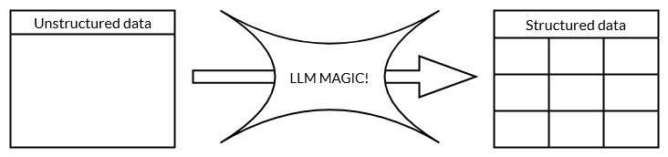

# Workshop Data Collection with LLMs in Social Sciences

This repository contains the code and slides for our workshop on data collection and inference with Large Language Models. More information & sign-up can be found on the website [here](https://odissei-data.nl/event/workshop-llm/).

## Technical details
- No previous experience with LLMs is required
- Participants should be able to understand and write `R` or `python` code
- In python we will use [`langchain`](https://python.langchain.com/docs/introduction/), in R we will use [`ellmer`](https://ellmer.tidyverse.org/) to interact with LLMs

## Schedule

| Time  | Title                                | Required resource                                                                            |
| :---- | :----------------------------------- | :------------------------------------------------------------------------------------------- |
| 09:30 | LLM fundamentals for Social Sciences | [`slides`](./slides/llm_workshop_slides.pdf)                                                 |
| 10:15 | Coffee break                         | Coffee is provided!                                                                          |
| 10:30 | Data collection with LLMs            | [`python`](./notebooks/llm_data_collection_py.ipynb), [`R`](./notebooks/llm_data_collection_R.ipynb) |
| 12:00 | Break                                | Lunch is provided!                                                                           |
| 12:45 | Inference with LLM-collected data    | [`python`](./notebooks/llm_inference_py.ipynb), [`R`](./notebooks/llm_inference_R.ipynb)     |
| 13:45 | Conclusion & Q&A                     |                                                                                              |

## Contact

This project is developed and maintained by the [ODISSEI Social Data Science (SoDa)](https://odissei-soda.nl/) team.

Do you have questions, suggestions, or remarks? File an [issue](https://github.com/sodascience/workshop_llm_data_collection/issues) or feel free to contact [Qixiang Fang](https://github.com/fqixiang) or [Erik-Jan van Kesteren](https://github.com/vankesteren).