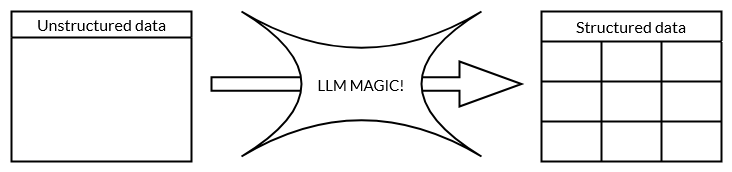
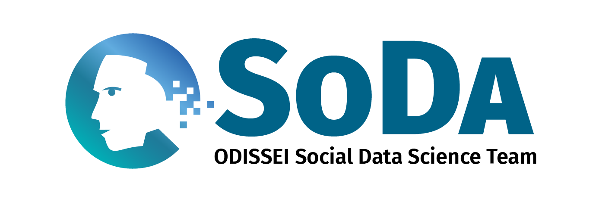

# Workshop Data Collection with LLMs in Social Sciences

This repository contains the code and slides for our workshop on data collection and inference with Large Language Models. The materials on this page are [CC-BY-4.0](https://creativecommons.org/licenses/by/4.0/) licensed.

 

More information can be found on the website [here](https://sodascience.github.io/workshop_llm_data_collection/).

## Technical details
- No previous experience with LLMs is required.
- `R` or `python` programming knowledge is desired but not required.
- In python we will use [`langchain`](https://python.langchain.com/docs/introduction/), in R we will use [`ellmer`](https://ellmer.tidyverse.org/) to interact with LLMs.

## Preparation (API keys)
You will need an API key for each provider you plan to use.

- **Hugging Face Inference API (recommended):**
	1. Create an account at https://huggingface.co/.
	2. Go to https://huggingface.co/settings/tokens and create a new access token.

- **OpenAI (optional):**
	1. Create an account at https://platform.openai.com/.
	2. Create an API key at https://platform.openai.com/api-keys.

Save your API keys in a safe place. The notebooks will prompt you to enter the keys at runtime.

## Slides
- Full workshop slides (v2026.01.23): [`Download`](./slides/soda_llm_workshop_slides.pdf)
- ODISSEI 2025 workshop slides: [`Download`](./slides/soda_llm_workshop_odissei_25_slides.pdf)

## Tutorial Paper
- [`Download`](./llm_social_science_paper.pdf)

## Full Workshop Schedule

| Time  | Title                                | Resource                                                                            |
| :---- | :----------------------------------- | :------------------------------------------------------------------------------------------- |
| 09:30 | LLM fundamentals for Social Sciences |                                                  |
| 11:00 | Coffee break                         | Coffee is provided!                                                                          |
| 11:20 | Data collection/annotation with LLMs | [`python`](https://colab.research.google.com/github/sodascience/workshop_llm_data_collection/blob/main/notebooks/llm_data_collection_py.ipynb), [`R`](https://colab.research.google.com/github/sodascience/workshop_llm_data_collection/blob/main/notebooks/llm_data_collection_R.ipynb) |
| 12:30 | Break                                | Lunch is provided!                                                                           |
| 13:15 | Inference with LLM annotations    | [`python`](https://colab.research.google.com/github/sodascience/workshop_llm_data_collection/blob/main/notebooks/llm_inferential_regression_py.ipynb), [`R`](https://colab.research.google.com/github/sodascience/workshop_llm_data_collection/blob/main/notebooks/llm_inferential_regression_R.ipynb)     |
| 14:30 | Conclusion & Q&A                     |                                                                                              |

Methods and software for inference with measurement error correction: [sodascience/social_science_inferences_with_llms](https://github.com/sodascience/social_science_inferences_with_llms).

## Run locally with uv
If you plan to run the notebooks locally, we recommend using [`uv`](https://github.com/astral-sh/uv) to set up a clean Python environment. You can also use `uv` to launch Jupyter Lab or Notebook.

1. Clone the repository:
	- `git clone https://github.com/sodascience/workshop_llm_data_collection.git`
	- `cd workshop_llm_data_collection`
2. Create and sync the environment:
	- `uv venv`
	- `uv sync`
3. Start Jupyter:
	- `uv run jupyter lab`  (or `uv run jupyter notebook`)

If you use a different environment manager, make sure the dependencies in `pyproject.toml` are installed before running the notebooks.

## Contact

This project is developed and maintained by the [ODISSEI Social Data Science (SoDa)](https://odissei-soda.nl/) team.

Do you have questions, suggestions, or remarks? File an [issue](https://github.com/sodascience/workshop_llm_data_collection/issues) or feel free to contact [Qixiang Fang](https://github.com/fqixiang) or [Erik-Jan van Kesteren](https://github.com/vankesteren).
